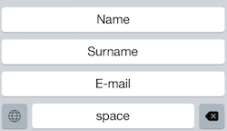
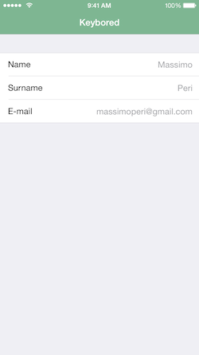

#  Keybored

A custom keyboard for iOS8, to quickly type boring recurring pieces of information such as name, surname and e-mail address.

## Installation

Build and install the companion Keybored app on your device.

After installing, go to **Settings > General > Keyboard > Add New Keyboard** and select **Keybored**.

After adding, tap the newly added Keybored keyboard and toggle the switch to **Allow Full Access**.

## Usage

Fill your details inside the Keybored companion app.

## Changelog

### 0.0.1
- First version.

### 0.0.2
- Added space button.
- Added Italian localization for the containing app.

### 0.0.3
- Added app icon.
- Added launch screen.

## Contact

Massimo Peri

- http://github.com/massimoksi
- http://twitter.com/massimoksi
- massimoperi@gmail.com

## License

Keybored is available under the MIT license. See the LICENSE file for more info.
